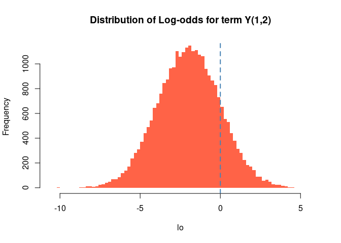
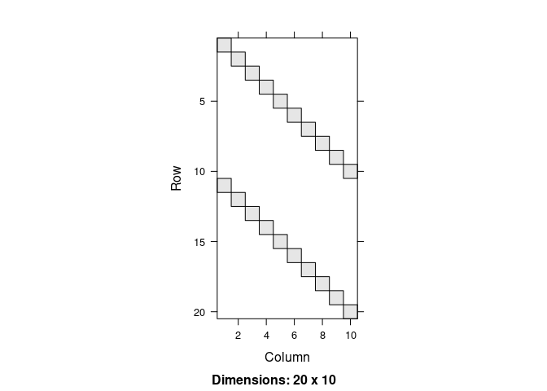

<!-- README.md is generated from README.Rmd. Please edit that file -->

# defm: Fit and simulate discrete binary exponential family models

<!-- badges: start -->

[](https://CRAN.R-project.org/package=defm)
[](https://CRAN.R-project.org/package=defm)
[](https://github.com/UofUEpiBio/defm/actions/workflows/r.yml)
<!-- badges: end -->

Discrete exponential family models (DEFM) have a long tradition with
extensive development rooted in exponential random graph models (ERGMs.)
Applicable to any form o data that can be represented as binary arrays,
DEFMs provide a way to model jointly distributed binary variables.

This package, built on top of the C++ library
[`barry`](https://github.com/USCbiostats/barry), provides a
computationally efficient implementation of this family of models.

# Installation

You can install `defm` using devtools:

``` r
devtools::install_github("UofUEpi/defm")
```

# Examples

## Example 1: Four outcomes

In this example, we will simulate a dataset that contains 1,000
individuals with four different outcomes. The outcomes, 0/1 vectors,
will be modeled as Markov processes of order one. Future states of this
0/1 vector are a function of the previous point in time. The following
lines simulate the baseline data:

``` r
library(defm)
#> Loading required package: stats4

# Simulation parameters
set.seed(1231)
n   <- 5000L # Count of individuals
n_y <- 3L    # Number of dependent variables
n_x <- 2L    # Number of independent variables

# Simulating how many observations we will have per individuals
n_reps <- sample(3:10, n, replace = TRUE)

# Final number of rows in the data
n_t <- sum(n_reps)

# Simulating the data
Y <- matrix(as.integer(runif(n_y * n_t) < .1), ncol = n_y)
colnames(Y) <- paste0("y", 1:n_y - 1)
X <- matrix(rnorm(n_x * n_t), ncol = n_x)
colnames(X) <- paste0("x", 1:n_x - 1L)
id <- rep(1L:n, n_reps)
time <- unlist(sapply(n_reps, \(x) 1:x))
```

Here is a brief look at the data structure. Remember, we still have not
actually simulated data **WITH THE MODEL**.

|  id | time |  y0 |  y1 |  y2 |    x0 |    x1 |
|----:|-----:|----:|----:|----:|------:|------:|
|   1 |    1 |   0 |   0 |   0 |  0.51 |  0.95 |
|   1 |    2 |   0 |   0 |   0 |  0.16 |  0.25 |
|   1 |    3 |   0 |   0 |   0 |  1.20 | -1.72 |
|   1 |    4 |   0 |   1 |   0 | -0.20 |  1.55 |
|   2 |    1 |   0 |   1 |   0 | -0.15 | -0.68 |
|   2 |    2 |   1 |   0 |   0 |  1.19 |  0.92 |
|   2 |    3 |   0 |   0 |   1 | -0.65 |  1.16 |
|   2 |    4 |   0 |   0 |   0 | -0.99 |  0.21 |
|   2 |    5 |   0 |   0 |   0 |  0.76 |  1.45 |
|   2 |    6 |   0 |   0 |   0 | -0.68 | -1.34 |

For this example, we will simulate a model with the following features:

- **Ones**: Baseline density (prevalence of ones),
  

- **Ones x Attr 2**: Same as before, but weighted by one of the
  covariates. (simil to fixed effect)
  

- **Transition** : And a transition structure, in particular
  `y0 -> (y0, y1)`,
  .

In `defm`, transition statistics can be represented using matrices. In
this case, the transition can be written as:

![\begin{array}{c}t\\t+1\end{array}\left\[\begin{array}{ccc}1 & \cdot & \cdot \\ 1 & 1 & \cdot\end{array}\right\]](https://latex.codecogs.com/gif.image?%5Cbegin%7Barray%7D%7Bc%7Dt%5C%5Ct%2B1%5Cend%7Barray%7D%5Cleft%5B%5Cbegin%7Barray%7D%7Bccc%7D1%20%26%20%5Ccdot%20%26%20%5Ccdot%20%5C%5C%201%20%26%201%20%26%20%5Ccdot%5Cend%7Barray%7D%5Cright%5D "\begin{array}{c}t\\t+1\end{array}\left[\begin{array}{ccc}1 & \cdot & \cdot \\ 1 & 1 & \cdot\end{array}\right]")

which in `R` is

``` r
> matrix(c(1,NA_integer_,NA_integer_,1,1,NA_integer_), nrow = 2, byrow = TRUE)
#      [,1] [,2] [,3]
# [1,]    1   NA   NA
# [2,]    1    1   NA
```

The `NA` entries in the matrix mean that those can be either zero or
one. In other words, only values different from `NA` will be considered
for specifying the terms. Here is the factory function:

``` r
# Creating the model and adding a couple of terms
build_model <- function(id., Y., X., order. = 1, par. = par.) {
  
  # Mapping the data to the C++ wrapper
  d_model. <- new_defm(id., Y., X., order = order.)

  # Adding the model terms
  term_defm_ones(d_model.)
  term_defm_ones(d_model., "x1")
  
  transition <- matrix(NA_integer_, nrow = order. + 1, ncol = ncol(Y.))
  transition[c(1,2,4)] <- 1
  
  term_defm_transition(d_model., transition)
  
  # Initializing the model
  init_defm(d_model.)
  
  # Returning
  d_model.
  
}
```

With this factory function, we will use it to simulate some data with
the same dimensions of the original dataset. In this case, the
parameters used for the simulation will be:

- **Ones**: -2, i.e., low density,
- **Ones x Attr 2**: 2, yet correlated with covariate \# 2,
- **Transition** : 5, And a high chance of observing the transition
  `y0 -> (y0, y1)`

``` r
sim_par <- c(-2, 2, 5)
d_model <- build_model(id, Y, X, order = 1L, par. = sim_par)
simulated_Y <- sim_defm(d_model, sim_par)
head(cbind(id, simulated_Y))
#>      id      
#> [1,]  1 0 0 0
#> [2,]  1 0 0 1
#> [3,]  1 0 0 0
#> [4,]  1 1 1 1
#> [5,]  2 0 1 0
#> [6,]  2 1 1 0
```

Now, let’s see if we can recover the parameters using MLE:

``` r
d_model_sim <- build_model(id, simulated_Y, X, order = 1, par. = sim_par)
ans <- defm_mle(d_model_sim)

summary(ans)
#> Maximum likelihood estimation
#> 
#> Call:
#> stats4::mle(minuslogl = minuslog, start = start, method = "L-BFGS-B", 
#>     nobs = nrow_defm(object) + ifelse(morder_defm(object) > 0, 
#>         -nobs_defm(object), 0L), lower = lower, upper = upper)
#> 
#> Coefficients:
#>                           Estimate Std. Error
#> Num. of ones             -2.009506 0.01435074
#> Num. of ones x x1         2.020209 0.01592269
#> Motif {y0⁺} ⇨ {y0⁺, y1⁺}  5.051076 0.04649995
#> 
#> -2 log L: 54960.47
```

Or better, we can use `texreg` to generate a pretty output:

<table class="texreg" style="margin: 10px auto;border-collapse: collapse;border-spacing: 0px;caption-side: bottom;color: #000000;border-top: 2px solid #000000;">
<caption>
Statistical models
</caption>
<thead>
<tr>
<th style="padding-left: 5px;padding-right: 5px;">
 
</th>
<th style="padding-left: 5px;padding-right: 5px;">
Model 1
</th>
</tr>
</thead>
<tbody>
<tr style="border-top: 1px solid #000000;">
<td style="padding-left: 5px;padding-right: 5px;">
Num. of ones
</td>
<td style="padding-left: 5px;padding-right: 5px;">
-2.01 (0.01)<sup>\*\*\*</sup>
</td>
</tr>
<tr>
<td style="padding-left: 5px;padding-right: 5px;">
Num. of ones x x1
</td>
<td style="padding-left: 5px;padding-right: 5px;">
2.02 (0.02)<sup>\*\*\*</sup>
</td>
</tr>
<tr>
<td style="padding-left: 5px;padding-right: 5px;">
Motif {y0⁺} ⇨ {y0⁺, y1⁺}
</td>
<td style="padding-left: 5px;padding-right: 5px;">
5.05 (0.05)<sup>\*\*\*</sup>
</td>
</tr>
<tr style="border-top: 1px solid #000000;">
<td style="padding-left: 5px;padding-right: 5px;">
AIC
</td>
<td style="padding-left: 5px;padding-right: 5px;">
54966.47
</td>
</tr>
<tr>
<td style="padding-left: 5px;padding-right: 5px;">
BIC
</td>
<td style="padding-left: 5px;padding-right: 5px;">
54991.16
</td>
</tr>
<tr style="border-bottom: 2px solid #000000;">
<td style="padding-left: 5px;padding-right: 5px;">
N
</td>
<td style="padding-left: 5px;padding-right: 5px;">
27777
</td>
</tr>
</tbody>
<tfoot>
<tr>
<td style="font-size: 0.8em;" colspan="2">
<sup>\*\*\*</sup>p \< 0.001; <sup>\*\*</sup>p \< 0.01; <sup>\*</sup>p \<
0.05
</td>
</tr>
</tfoot>
</table>

We can also see the counts

|  id |  y0 |  y1 |  y2 |    x0 |    x1 |     |      |     |
|----:|----:|----:|----:|------:|------:|----:|-----:|----:|
|   1 |   0 |   0 |   0 |  0.51 |  0.95 |  NA |   NA |  NA |
|   1 |   0 |   0 |   1 |  0.16 |  0.25 |   1 | 0.25 |   0 |
|   1 |   0 |   0 |   0 |  1.20 | -1.72 |   0 | 0.00 |   0 |
|   1 |   1 |   1 |   1 | -0.20 |  1.55 |   3 | 4.66 |   0 |
|   2 |   0 |   1 |   0 | -0.15 | -0.68 |  NA |   NA |  NA |
|   2 |   1 |   1 |   0 |  1.19 |  0.92 |   2 | 1.84 |   0 |
|   2 |   1 |   1 |   1 | -0.65 |  1.16 |   3 | 3.48 |   1 |
|   2 |   1 |   1 |   0 | -0.99 |  0.21 |   2 | 0.43 |   1 |
|   2 |   1 |   1 |   1 |  0.76 |  1.45 |   3 | 4.35 |   1 |
|   2 |   0 |   0 |   0 | -0.68 | -1.34 |   0 | 0.00 |   0 |

Finally, we can also take a look at the distribution of the log odds. We
calculate this by looking at changes in a single entry of the array. For
example, the log-odds of having
,
which are equivalent to

}{\mbox{Pr}\left(\left.y_{12} = 0\vphantom{\mathbf{y}_{-12}}\;\right|\mathbf{y}_{-12}\vphantom{y_{12} = 0}\right)}} = \mbox{logit}\left(\mbox{Pr}\left(\left.y_{12} = 1\vphantom{\mathbf{y}_{-12}}\;\right|\mathbf{y}_{-12}\vphantom{y_{12} = 1}\right)\right)")

We can use the `logodds` function for this:

``` r
lo <- logodds(d_model_sim, coef(ans), 1,  2) 
hist(lo, main = "Distribution of Log-odds for term Y(1,2)",
     col="tomato", border = "transparent", breaks = 100)
abline(v=0, lwd = 2, lty = 2, col = "steelblue")
```



## Example 2: A fun model

For fun, imagine that we want to describe a process in which an
individual moves sequentially through a set of states. In this example,
there are ten different `y` variables, but the person can only have one
of them as active (equal to one.) We can simulate such data using DEFM.

We first need to generate the baseline data for the simulation. This
involves creating a matrix of size 20x10 (so we have 20 time points,)
filled with zeros in all but the first entry:

``` r
n   <- 20L
n_y <- 10L
id <- rep(1L, n)
Y <- matrix(0L, nrow = n, ncol = n_y)
Y[1] <- 1L
X <- matrix(0.0, nrow = n, ncol = 1)
```

With the data in hand, we can now simulate the process. First, we need
to build the model. The key component of the model will be the
transition matrices:

<!-- $$
\left[\begin{array}{cccc}
1 & 0 & NA & \dots \\
0 & 1 & NA & \dots
\end{array}\right] \dots 
\left[\begin{array}{cccccc}
\dots & NA & 1 & 0 & NA & \dots  \\
\dots & NA & 0 & 1 & NA & \dots  
\end{array}\right] \dots 
\left[\begin{array}{cccc}
\dots & NA & 1 & 0 \\
\dots & NA & 0 & 1 
\end{array}\right]
$$ -->

<div align="center">


</div>

Let’s take a look at the process:

``` r
# Creating a new instance of a DEFM object
d_model <- new_defm(id = id, Y = Y, X = X, order = 1)

# Creating the transition terms, these
for (i in (1:(n_y - 1) - 1)) {
  transition <- matrix(NA_integer_, nrow = 2, ncol = n_y)
  transition[c(1:4) + 2 * i] <- c(1,0,0,1)
  term_defm_transition(d_model, transition)
}

# Here is the last transition term
transition <- matrix(NA_integer_, nrow = 2, ncol = n_y)
transition[c(n_y * 2 - 1, n_y * 2, 1, 2)] <- c(1,0,0,1)
term_defm_transition(d_model, transition)

# Adding a term of ones
term_defm_ones(d_model)

# Initializing and simulating
init_defm(d_model)
Y_sim <-sim_defm(d_model, par = c(rep(100, n_y), -10))
```

The simulation should produce a nice-looking figure:



## Example 3: Using formulas for transitions

In this example, we will redo the previous model, but now use formulas
for specifying the transitions:

``` r
d_model_formula <- new_defm(id = id, Y = Y, X = X, order = 1)

# We can use text formulas to add transition terms
d_model_formula <- d_model_formula + 
  "{y0, 0y1} > {0y0, y1}" +
  "{y1, 0y2} > {0y1, y2}" +
  "{y2, 0y3} > {0y2, y3}" +
  "{y3, 0y4} > {0y3, y4}" +
  "{y4, 0y5} > {0y4, y5}" +
  "{y5, 0y6} > {0y5, y6}" +
  "{y6, 0y7} > {0y6, y7}" +
  "{y7, 0y8} > {0y7, y8}" +
  "{y8, 0y9} > {0y8, y9}" +
  "{0y0, y9} > {y0, 0y9}" 

d_model_formula |>
  term_defm_ones()
  
init_defm(d_model_formula)

# Inspecting
d_model_formula
#> Num. of Arrays       : 19
#> Support size         : 19
#> Support size range   : [11, 20]
#> Transform. Fun.      : no
#> Model terms (11)    :
#>  - Motif {y0⁺, y1⁻} ⇨ {y0⁻, y1⁺}
#>  - Motif {y1⁺, y2⁻} ⇨ {y1⁻, y2⁺}
#>  - Motif {y2⁺, y3⁻} ⇨ {y2⁻, y3⁺}
#>  - Motif {y3⁺, y4⁻} ⇨ {y3⁻, y4⁺}
#>  - Motif {y4⁺, y5⁻} ⇨ {y4⁻, y5⁺}
#>  - Motif {y5⁺, y6⁻} ⇨ {y5⁻, y6⁺}
#>  - Motif {y6⁺, y7⁻} ⇨ {y6⁻, y7⁺}
#>  - Motif {y7⁺, y8⁻} ⇨ {y7⁻, y8⁺}
#>  - Motif {y8⁺, y9⁻} ⇨ {y8⁻, y9⁺}
#>  - Motif {y0⁻, y9⁺} ⇨ {y0⁺, y9⁻}
#>  - Num. of ones
#> Model rules (1)     :
#>  - Markov model of order 1
#> Model Y variables (10):
#>   0) y0
#>   1) y1
#>   2) y2
#>   3) y3
#>   4) y4
#>   5) y5
#>   6) y6
#>   7) y7
#>   8) y8
#>   9) y9

# Simulating
(Y_sim_formula <- sim_defm(d_model_formula, par = c(rep(20, n_y), -10)))
#>       [,1] [,2] [,3] [,4] [,5] [,6] [,7] [,8] [,9] [,10]
#>  [1,]    1    0    0    0    0    0    0    0    0     0
#>  [2,]    0    1    0    0    0    0    0    0    0     0
#>  [3,]    0    0    1    0    0    0    0    0    0     0
#>  [4,]    0    0    0    1    0    0    0    0    0     0
#>  [5,]    0    0    0    0    1    0    0    0    0     0
#>  [6,]    0    0    0    0    0    1    0    0    0     0
#>  [7,]    0    0    0    0    0    0    1    0    0     0
#>  [8,]    0    0    0    0    0    0    0    1    0     0
#>  [9,]    0    0    0    0    0    0    0    0    1     0
#> [10,]    0    0    0    0    0    0    0    0    0     1
#> [11,]    1    0    0    0    0    0    0    0    0     0
#> [12,]    0    1    0    0    0    0    0    0    0     0
#> [13,]    0    0    1    0    0    0    0    0    0     0
#> [14,]    0    0    0    1    0    0    0    0    0     0
#> [15,]    0    0    0    0    1    0    0    0    0     0
#> [16,]    0    0    0    0    0    1    0    0    0     0
#> [17,]    0    0    0    0    0    0    1    0    0     0
#> [18,]    0    0    0    0    0    0    0    1    0     0
#> [19,]    0    0    0    0    0    0    0    0    1     0
#> [20,]    0    0    0    0    0    0    0    0    0     1
```

The new simulation…


# Acknowledgement

This work was supported by the Assistant Secretary of Defense for Health
Affairs endorsed by the Department of Defense, through the Psychological
Health/Traumatic Brain Injury Research Program Long-Term Impact of
Military-Relevant Brain Injury Consortium (LIMBIC)
Award/W81XWH-18-PH/TBIRP-LIMBIC under Award No. I01 RX003443. The U.S.
Army Medical Research Acquisition Activity, 839 Chandler Street, Fort
Detrick MD 21702-5014 is the awarding and administering acquisition
office. Opinions, interpretations, conclusions and recommendations are
those of the author and are not necessarily endorsed by the Department
of Defense. Any opinions, findings, conclusions, or recommendations
expressed in this publication are those of the author(s) and do not
necessarily reflect the views of the U.S. Government, the U.S.
Department of Veterans Affairs or the Department of Defense and no
official endorsement should be inferred.

# Code of Conduct

Please note that the `defm` project is released with a [Contributor Code
of
Conduct](https://contributor-covenant.org/version/2/0/CODE_OF_CONDUCT.html).
By contributing to this project, you agree to abide by its terms.
